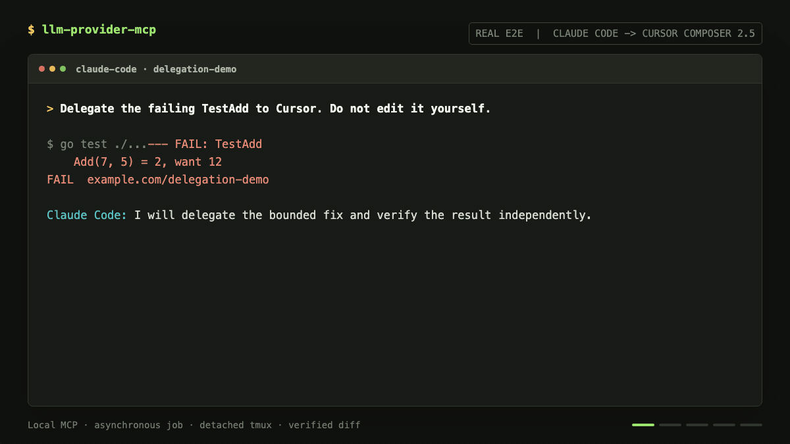
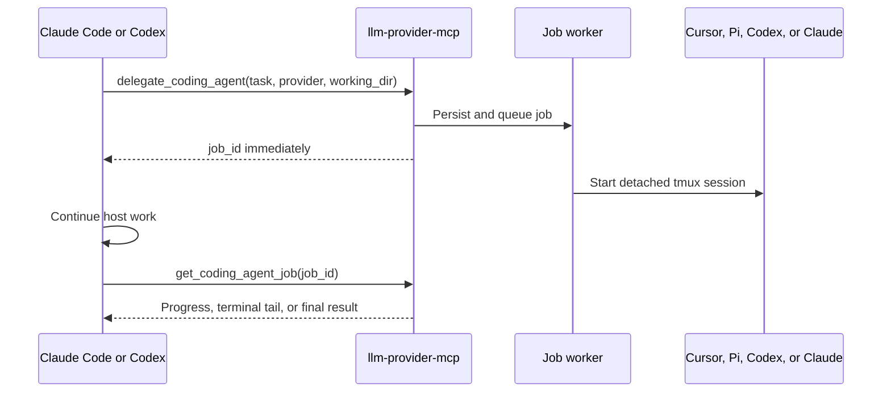

# llm-provider-mcp

[](https://github.com/manishiitg/llm-provider-mcp/actions/workflows/ci.yml)
[](https://github.com/manishiitg/llm-provider-mcp/releases)
[](LICENSE)

Delegate coding work between Claude Code, Codex, Cursor Agent, and Pi.

`llm-provider-mcp` is a local MCP server for asynchronous coding-agent
delegation. A Codex or Claude Code session can start work in another coding CLI,
receive a job ID immediately, continue its own work, and collect the delegated
result later.

Delegated agents run locally in detached tmux sessions using their existing
logins, model access, filesystem permissions, and the host's current trusted
project directory.



This is a real Claude Code to Cursor Composer 2.5 run: the job completed in 28
seconds and Claude independently verified the diff and uncached test result.
[See the reproducible demo and sanitized transcript.](docs/demo.md)

## Quick Start

Requirements:

- macOS or Linux
- tmux 3.x or newer
- Codex or Claude Code as an MCP host
- At least one authenticated target: Cursor Agent, Pi, Codex, or Claude Code

From the project where you want to use delegation, run:

```bash
curl -fsSL https://raw.githubusercontent.com/manishiitg/llm-provider-mcp/main/scripts/install-mcp.sh | sh
```

The interactive setup detects installed CLIs, lets you select multiple hosts
and targets, verifies authentication, registers the MCP server only for the
current project, and installs a small delegation skill.

Start a new Codex or Claude Code session in that project and ask naturally:

```text
Delegate the failing authentication test to Cursor using composer-2.5.
Keep working here and check the delegated job when it is ready.
```

The host receives a response shaped like:

```json
{
  "job_id": "job_03070f8a2626b50ace1a67a463db9b4d",
  "provider": "cursor-cli",
  "status": "queued",
  "poll_after_seconds": 15,
  "next_tool": "get_coding_agent_job"
}
```

See [Installation](docs/installation.md) for manual and security-conscious
installation options.

## Why Use It

- Use a stronger model for an independent review or difficult implementation.
- Route small work to a faster or lower-cost model without leaving the host.
- Access Cursor, Gemini, OpenRouter, MiniMax, GLM, and Kimi models from Codex or
  Claude Code.
- Run independent delegations concurrently without blocking the host session.
- Inspect a live terminal tail or attach directly to tmux when human attention
  is needed.
- Keep credentials with the native CLIs instead of copying API keys into the
  MCP server.

## Supported Coding CLIs

| CLI | MCP host | Delegation target | Model selection |
|---|---:|---:|---|
| Codex CLI | Yes | Yes | Codex model IDs and reasoning levels |
| Claude Code | Yes | Yes | Claude Code model selectors |
| Cursor Agent | Manual registration | Yes | Composer, Grok, and account-visible models |
| Pi CLI | Manual registration | Yes | Gemini, OpenRouter, MiniMax, GLM, and Kimi |

The setup wizard currently registers Codex and Claude Code as hosts. Cursor and
Pi can use the same stdio MCP server through manual project configuration. All
four CLIs can run as local delegation targets.

Gemini CLI and Antigravity CLI remain available only as deprecated Go-library
compatibility integrations and are not offered during new MCP setup.

See [Providers and models](docs/providers.md) for selectors, authentication
commands, and provider-specific behavior.

## How Delegation Works



1. The host passes its current trusted project and a bounded task.
2. The server validates the provider and workspace, then persists the job in
   SQLite.
3. A detached worker launches the target CLI in tmux.
4. The host polls after the recommended interval while continuing other work.
5. The host reviews the final result and verifies any workspace changes.

Polling is the current completion mechanism. MCP task notifications are planned
after behavior is consistent across supported hosts.

See [Delegation workflow](docs/delegation.md) and
[Architecture](docs/architecture.md) for the complete lifecycle.

## MCP Tools

The server exposes five tools:

| Tool | Purpose |
|---|---|
| `list_coding_agents` | List enabled delegation targets and capabilities |
| `list_coding_agent_models` | Discover curated model selectors |
| `delegate_coding_agent` | Start an asynchronous coding job |
| `get_coding_agent_job` | Read status, progress, terminal output, or result |
| `cancel_coding_agent_job` | Stop a queued or running job |

Running jobs include a tmux attach command for direct human inspection.
`get_coding_agent_job` can also return a bounded, ANSI-cleaned terminal tail.

## CLI Commands

```bash
llm-provider-mcp setup
llm-provider-mcp doctor
llm-provider-mcp models cursor-cli
llm-provider-mcp models pi-cli --json
llm-provider-mcp uninstall
```

`setup`, `doctor`, and `uninstall` are designed to work without additional
arguments. Run `llm-provider-mcp --help` for automation flags.

## Security And Trust

- The MCP server and delegated CLIs run on the local machine.
- Credentials remain owned by each native CLI and are never collected by setup.
- Setup writes project-local MCP and skill configuration only after showing the
  exact paths.
- The host supplies its current trusted project as `working_dir`; users are not
  asked to enter it for every job.
- Detached agents use unattended provider-specific policies so they do not
  block on invisible approval prompts.
- `LLM_PROVIDER_MCP_WORKSPACE_ROOTS` can restrict accepted working directories,
  but it is not a process sandbox.

Pi currently has no hard workspace sandbox, so its shell and file tools retain
the permissions of the local user. Do not delegate untrusted prompts or
repositories to Pi.

Read [Security and trust](docs/security-and-trust.md) before enabling unattended
delegation in sensitive repositories.

## Current Limitations

- macOS and Linux only; Windows is not currently supported.
- tmux is required for delegated execution and live inspection.
- Completion is polling-based rather than pushed to the host.
- Host auto-registration currently supports Codex and Claude Code.
- Target model availability depends on the user's existing CLI account.
- A delegated agent can modify the working tree; the host must review and test
  those changes before accepting them.

## Documentation

- [Installation](docs/installation.md)
- [Delegation workflow](docs/delegation.md)
- [Providers and models](docs/providers.md)
- [Security and trust](docs/security-and-trust.md)
- [Architecture](docs/architecture.md)
- [Troubleshooting](docs/troubleshooting.md)
- [Go compatibility library](docs/go-provider-library.md)
- [Roadmap](ROADMAP.md)

## Go Compatibility Library

This repository also contains the Go provider module used by MCP Agent and MCP
Agent Builder. Its existing module path remains intentionally unchanged:

```bash
go get github.com/manishiitg/multi-llm-provider-go@latest
```

The general provider APIs remain supported for downstream compatibility, but
the primary product surface of this repository is `llm-provider-mcp`. See the
[Go compatibility library documentation](docs/go-provider-library.md).

## Development

```bash
make build-mcp
go test ./...
golangci-lint run --timeout=5m ./...
```

The CI suite also compile-checks MCP Agent and MCP Agent Builder against the
current checkout to prevent accidental public-API breakage.

See [CONTRIBUTING.md](CONTRIBUTING.md) before opening a pull request. Report
security issues using [SECURITY.md](SECURITY.md), not a public issue.

## License

[MIT](LICENSE)
