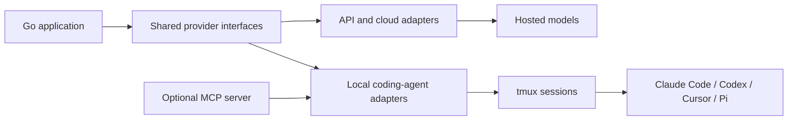

# Multi-LLM Provider for Go

[](https://github.com/manishiitg/llm-provider-mcp/actions/workflows/ci.yml)
[](https://github.com/manishiitg/llm-provider-mcp/releases)
[](LICENSE)

`multi-llm-provider-go` is a Go library for using hosted LLM APIs and local
coding agents through a shared set of provider interfaces.

It supports two complementary ways to run a model:

- **API providers** call hosted models through their normal SDK or HTTP
  transport, including OpenAI, Anthropic, Bedrock, Vertex AI, Azure, and
  OpenRouter.
- **Coding-agent providers** run Claude Code, Codex CLI, Cursor Agent, or Pi in
  local tmux sessions, preserving their native tools, subscriptions, project
  context, and authenticated sessions.

The repository also includes `llm-provider-mcp`, an optional MCP server for
delegating asynchronous work between coding agents. It is one way to expose the
provider library—not the library's only use case.

## Why This Exists

Applications should be able to choose the right model and transport for each
task without rebuilding their orchestration layer.

Use a direct API when you want a conventional request/response integration,
predictable infrastructure, or model-level features such as structured output,
embeddings, and media generation. Use a coding-agent CLI when you want an agent
that can inspect a repository, edit files, run commands, and reuse an existing
local subscription. Both fit behind the same Go model abstraction.


```mermaid
flowchart LR
    App[Go application] --> Provider[Shared provider interfaces]
    Provider --> API[API and cloud adapters]
    Provider --> CLI[Local coding-agent adapters]
    API --> Hosted[Hosted models]
    CLI --> Tmux[tmux sessions]
    Tmux --> Agents[Claude Code / Codex / Cursor / Pi]
    MCP[Optional MCP server] --> CLI
```

## Supported Providers

The core `InitializeLLM` factory returns the same `llmtypes.Model` interface for
text and coding-agent providers:

| Provider ID | Integration | Transport |
|---|---|---|
| `openai` | OpenAI | OpenAI Go SDK |
| `anthropic` | Anthropic | Anthropic Go SDK |
| `openrouter` | OpenRouter | OpenAI-compatible API |
| `bedrock` | AWS Bedrock | AWS SDK |
| `vertex` | Google Vertex AI and Gemini | Google Gen AI SDK |
| `azure` | Azure AI | Azure/OpenAI-compatible API |
| `z-ai` | Z.AI | OpenAI-compatible API |
| `kimi` | Kimi/Moonshot | OpenAI-compatible API |
| `minimax`, `minimax-coding-plan` | MiniMax | Provider API |
| `claude-code` | Claude Code | Local CLI in tmux |
| `codex-cli` | Codex CLI | Local CLI in tmux by default |
| `cursor-cli` | Cursor Agent | Local CLI in tmux |
| `pi-cli` | Pi | Local CLI in tmux by default |

Specialized factories expose capabilities that do not fit the text-model
interface:

| Capability | Providers |
|---|---|
| Embeddings | OpenAI, OpenRouter, Vertex AI, Bedrock |
| Image generation | Vertex AI, MiniMax Coding Plan, Codex CLI |
| Video generation | Vertex AI (Veo and Gemini Omni) |
| Text to speech | Vertex AI, MiniMax, ElevenLabs, Deepgram |
| Audio transcription | Deepgram |
| Music generation | ElevenLabs, MiniMax |

Gemini models are available through Vertex AI for direct API access or through
Pi as a coding agent. The old Gemini CLI adapter has been removed.

## Common Capabilities

Provider support varies, but the shared interfaces cover:

- Text generation and streaming
- Tool calling and structured output
- Token usage, model metadata, logging, and event emission
- Embeddings
- Image input and generation
- Video generation and conversational video editing
- Audio generation and transcription
- Music generation
- Stateful coding-agent sessions, continuation, and terminal progress

## Quick Start: Go Library

Install the module:

```bash
go get github.com/manishiitg/multi-llm-provider-go@latest
```

The current module requires Go 1.25.12 or newer.

Initialize a provider and use the returned `llmtypes.Model`:

```go
package main

import (
    "context"
    "fmt"
    "log"

    llmproviders "github.com/manishiitg/multi-llm-provider-go"
    "github.com/manishiitg/multi-llm-provider-go/llmtypes"
)

func main() {
    model, err := llmproviders.InitializeLLM(llmproviders.Config{
        Provider: llmproviders.ProviderOpenAI,
        ModelID:  "gpt-4.1-mini",
    })
    if err != nil {
        log.Fatal(err)
    }

    response, err := model.GenerateContent(
        context.Background(),
        []llmtypes.MessageContent{
            llmtypes.TextParts(llmtypes.ChatMessageTypeHuman, "Explain tmux in one sentence."),
        },
    )
    if err != nil {
        log.Fatal(err)
    }

    if len(response.Choices) == 0 {
        log.Fatal("provider returned no choices")
    }
    fmt.Println(response.Choices[0].Content)
}
```

Set the credential expected by the selected provider—for example,
`OPENAI_API_KEY` for OpenAI. Credentials can also be supplied explicitly with
`Config.APIKeys`. See the [examples](examples/README.md) for streaming, tool
calls, custom logging, Bedrock, and Vertex AI.

## Configuration

`llmproviders.Config` controls provider initialization:

| Field | Purpose |
|---|---|
| `Provider` | Selects the API, cloud platform, or coding CLI |
| `ModelID` | Selects a model; provider defaults apply when supported |
| `Temperature` | Sets sampling temperature for providers that expose it |
| `APIKeys` | Supplies credentials explicitly instead of using the environment |
| `FallbackModels` / `MaxRetries` | Configures retry and fallback behavior |
| `Logger` / `EventEmitter` | Connects host logging, tracing, and model events |
| `Context` | Controls initialization lifetime and cancellation |

Common credential sources include:

| Provider | Environment or native authentication |
|---|---|
| OpenAI | `OPENAI_API_KEY` |
| Anthropic | `ANTHROPIC_API_KEY` |
| OpenRouter | `OPENROUTER_API_KEY` |
| AWS Bedrock | Standard AWS credential chain and `AWS_REGION` |
| Vertex AI | `VERTEX_API_KEY`, `GOOGLE_API_KEY`, or Google application credentials |
| Azure AI | `AZURE_AI_ENDPOINT` and `AZURE_AI_API_KEY` |
| Z.AI / Kimi | `ZAI_API_KEY`, `KIMI_API_KEY` |
| MiniMax | `MINIMAX_API_KEY` or `MINIMAX_CODING_PLAN_API_KEY` |
| ElevenLabs / Deepgram | `ELEVENLABS_API_KEY`, `DEEPGRAM_API_KEY` |
| Coding-agent CLIs | Existing native CLI login or provider configuration |

See [.env.example](.env.example) for common provider credentials. Model,
endpoint, fallback, and test-specific variables are documented next to the
provider adapters and tests that consume them.

Changing transports starts with changing the provider:

```go
config.Provider = llmproviders.ProviderAnthropic  // direct API
config.Provider = llmproviders.ProviderBedrock    // cloud API
config.Provider = llmproviders.ProviderCodexCLI   // local coding agent
config.Provider = llmproviders.ProviderCursorCLI  // local coding agent
```

Bounded coding-agent calls can use the process working directory and a temporary
session automatically. Long-lived host applications should explicitly pass
`CodingAgentWorkingDirOption`, `CodingAgentInteractiveSessionOption`, and
`CodingAgentPersistentInteractiveOption`. Provider-specific options additionally
control the model, approval policy, resume ID, tools, and streaming behavior.

## Coding Agents And tmux

The coding-agent adapters turn native coding CLIs into providers without
reimplementing their agent loops. They use each CLI's existing login and model
access, and run in a local project with that CLI's native file and shell tools.

tmux is the default transport because it supports long-lived interactive
sessions, multi-turn continuation, live terminal capture, control-key input,
and recovery after a caller disconnects.

| CLI | Provider ID | Authentication |
|---|---|---|
| Claude Code | `claude-code` | Existing Claude Code login or scoped OAuth token |
| Codex CLI | `codex-cli` | Existing Codex login |
| Cursor Agent | `cursor-cli` | Existing Cursor login |
| Pi CLI | `pi-cli` | Existing Pi/provider configuration |

Requirements for this transport:

- macOS or Linux
- tmux 3.x or newer
- At least one installed and authenticated coding CLI

The library exposes session lifecycle, resume, input, interrupt, pane capture,
and cleanup helpers so a host application can manage coding agents as part of
its own workflow.

## Module Layout

```text
multi-llm-provider-go/
├── providers.go                 # Provider IDs, configuration, initialization
├── provider_*.go                # Shared provider behavior and media factories
├── interfaces/                  # Logging, events, and public support contracts
├── llmtypes/                    # Messages, responses, tools, streams, options
├── pkg/adapters/                # API, cloud, media, and coding-CLI adapters
├── pkg/codingagentjob/          # Durable asynchronous job execution
├── pkg/codingagentmcp/          # Optional MCP tool surface
├── pkg/tmuxcapture/             # Terminal progress capture and cleanup
├── cmd/llm-chat/                # Local provider chat client
├── cmd/llm-test/                # Manual provider contract runner
└── cmd/llm-provider-mcp/        # Optional delegation MCP server
```

`llmtypes.Model` is the central text request/response interface. Additional
interfaces cover embeddings, image generation, video generation, audio
generation and transcription, and music generation.

## Optional: Asynchronous Delegation Over MCP

`llm-provider-mcp` packages the coding-agent providers as a local stdio MCP
server. A Codex or Claude Code host can queue work in another coding CLI,
continue working, and retrieve the result later. Jobs are persisted in SQLite
and executed in detached tmux sessions.

Install it in the project where you want delegation:

```bash
curl -fsSL https://raw.githubusercontent.com/manishiitg/llm-provider-mcp/main/scripts/install-mcp.sh | sh
```

The setup detects installed CLIs, registers selected hosts and targets for the
current project, verifies authentication, and installs the delegation skill.
The server is also published in the
[official MCP Registry](https://registry.modelcontextprotocol.io/docs) as
`io.github.manishiitg/llm-provider-mcp`.

It exposes five tools:

| Tool | Purpose |
|---|---|
| `list_coding_agents` | List enabled targets and capabilities |
| `list_coding_agent_models` | Discover available model selectors |
| `delegate_coding_agent` | Start an asynchronous coding job |
| `get_coding_agent_job` | Read progress, terminal output, or the final result |
| `cancel_coding_agent_job` | Stop a queued or running job |

See [Installation](docs/installation.md) and
[Delegation workflow](docs/delegation.md) for the complete MCP workflow.

## Security And Trust

- Direct API credentials remain in the host process or the provider's normal
  credential chain.
- Coding-agent credentials remain owned by the native CLI.
- tmux-backed agents have the local user's filesystem and process permissions;
  tmux is a transport, not a sandbox.
- A coding agent can modify the working tree and run commands. Review and test
  delegated changes before accepting them.
- `LLM_PROVIDER_MCP_WORKSPACE_ROOTS` can restrict directories accepted by the
  MCP server, but it does not create an operating-system sandbox.

Read [Security and trust](docs/security-and-trust.md) before enabling unattended
coding-agent execution in sensitive repositories.

## Testing And Coverage

The repository uses several layers of testing because hosted APIs and terminal
TUIs fail in different ways:

| Layer | What it verifies | Normal CI |
|---|---|:---:|
| Unit and adapter tests | Request conversion, event parsing, metadata, pricing, options, cleanup | Yes |
| Replay and fixture tests | Provider responses and terminal transcripts without network access | Yes |
| Contract tests | Shared behavior across API providers and coding agents | Yes |
| Real API tests | Authentication, live response shape, streaming, tools, media | Opt-in |
| Real coding-agent E2E | tmux launch, prompts, tools, resume, live input, cancellation, isolation | Opt-in |
| Downstream compile checks | Public API compatibility with MCP Agent and MCP Agent Builder | Yes |

API-provider coverage is not uniform. This inventory reflects the tests and
manual commands currently present in the repository:

| Provider | Deterministic or replay coverage | Opt-in live Go tests | Manual `llm-test` commands |
|---|:---:|:---:|:---:|
| OpenAI | Yes | Yes | Yes |
| Anthropic | Yes | Yes | Yes |
| Bedrock | Yes | Yes | Yes |
| Vertex AI | Yes | Yes | Yes |
| Azure AI | Replay | Not yet | Yes |
| OpenRouter | Replay | Not yet | Yes |
| Z.AI | Limited | Yes | Yes |
| Kimi | Model metadata | Yes | Not yet |
| MiniMax | Yes | Credential-gated | Yes |
| ElevenLabs / Deepgram | Not yet | Not yet | Not yet |

“Yes” does not mean every capability is covered. The
[API provider test contract](docs/api_provider_test_contract.md) distinguishes
automated Go tests, replay/manual smoke coverage, partial coverage, and known
gaps at feature level.

The coding-agent certification suite covers all four active CLI providers:

| Contract area | Claude Code | Codex CLI | Cursor Agent | Pi CLI |
|---|:---:|:---:|:---:|:---:|
| tmux launch and working directory | ✓ | ✓ | ✓ | ✓ |
| Native system instructions and prompt paste | ✓ | ✓ | ✓ | ✓ |
| Terminal progress and done detection | ✓ | ✓ | ✓ | ✓ |
| MCP bridge and tool policy | ✓ | ✓ | ✓ | ✓ |
| Persistent sessions and continuation | ✓ | ✓ | ✓ | ✓ |
| Live input, cancellation, and cleanup | ✓ | ✓ | ✓ | ✓ |
| Parallel/session isolation | ✓ | ✓ | ✓ | ✓ |

The coding-agent matrix shows the release-blocking contract areas. Broader
non-P0 certification gaps remain explicitly tracked in
`knownCertificationGaps`. These checks do not promise that every upstream CLI
version behaves identically. Real tests are gated by explicit environment
variables and require the relevant CLI login or provider credentials.

Run the offline suite and build the manual test client:

```bash
go test -p 1 ./...
make build
./bin/llm-test --help
```

Detailed, provider-by-provider coverage and real-test commands live in:

- [API provider test contract](docs/api_provider_test_contract.md)
- [Coding-agent tmux contract](docs/coding_sdk_tmux_contract.md)
- [Structured coding-agent contract](docs/coding_sdk_structured_contract.md)
- [Testing guide](docs/TESTING.md)

## Code Quality And Secret Scanning

The project uses `golangci-lint` for static analysis and `gitleaks` for secret
scanning:

```bash
make lint
make scan-secrets
```

## Documentation

- [Go provider API](docs/go-provider-library.md)
- [Examples](examples/README.md)
- [Coding-agent providers and models](docs/providers.md)
- [MCP installation](docs/installation.md)
- [Delegation workflow](docs/delegation.md)
- [Architecture](docs/architecture.md)
- [Security and trust](docs/security-and-trust.md)
- [API provider test contract](docs/api_provider_test_contract.md)
- [Coding-agent tmux contract](docs/coding_sdk_tmux_contract.md)
- [Replay and manual test runner](docs/TESTING.md)
- [Roadmap](ROADMAP.md)

## Development

```bash
make build
make build-mcp
go test -p 1 ./...
golangci-lint run --timeout=5m ./...
```

CI also compile-checks MCP Agent and MCP Agent Builder against the current
checkout to prevent accidental public API breakage.

See [CONTRIBUTING.md](CONTRIBUTING.md) before opening a pull request. Report
security issues using [SECURITY.md](SECURITY.md), not a public issue.

## License

[MIT](LICENSE)
