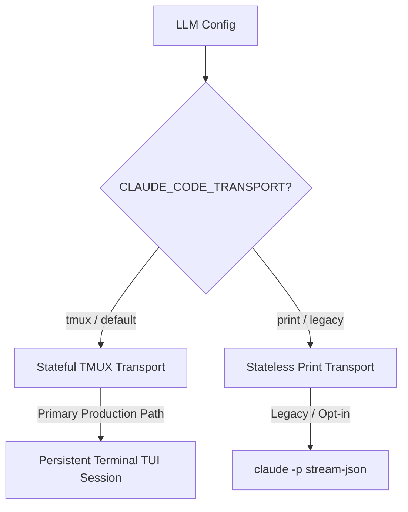

# Claude Code CLI Adapter Specification

## 🌟 Overview
The `claudecode` adapter in `multi-llm-provider-go` serves as a bridge to Anthropic's [Claude Code CLI](https://github.com/anthropics/claude-code) (`claude`). It exposes Claude's advanced local agentic capabilities, terminal execution powers, and efficient local context handling under the unified `llmtypes.Model` interface.

---

## 🏗️ Dual-Transport Architecture
To support both stateful interactive chats and lightweight stateless pipeline execution, the adapter supports a **Dual-Transport Model**:



### 1. Stateful TMUX Transport (Primary & Default)
*   **Transport Mode:** `CLAUDE_CODE_TRANSPORT=tmux` (or `experimental`).
*   **Behavior:** Spawns a persistent, stateful `tmux` terminal session running the interactive Claude Code TUI. The orchestrator interacts with Claude Code programmatically by pasting prompts directly into the terminal, observing state updates, and reading completed assistant turns.
*   **Status:** Production-ready and certified across all **26 standard tmux capabilities** (such as session-loss recovery, live input routing, workspace MCP config mapping, and slow-tool false-idle protection).

### 2. Stateless Print/Stream Transport (Legacy)
*   **Transport Mode:** `CLAUDE_CODE_TRANSPORT=print`.
*   **Behavior:** Treats the Claude CLI as a stateless chat completion endpoint. For every turn, the adapter replays the full conversation history from stdin using the CLI's specialized JSON communication mode.
*   **Status:** Legacy/Deprecated fallback. Requires `CLAUDE_CODE_ALLOW_LEGACY_PRINT=1` to be explicitly enabled in the environment.

---

## 🖥️ Stateful TMUX Transport Details

### Session Registry & Lifecycle
Long-running terminal sessions are mapped and maintained in an memory registry keyed by the calling application's session identifier:
```text
application_session_id ──> CLAUDE_CODE_TMUX_SESSION_PREFIX_int_xxx
```
*   **Reuse:** Completed turns return the terminal to an idle ready-prompt, keeping the tmux session alive for subsequent turns.
*   **Cleanup:** Process teardown cleans up registered active sessions gracefully using `/exit`, falling back to hard tmux SIGKILL only when unresponsive. Stranded sessions from previous backend runs are reaped at startup via `SweepOrphanedInteractiveTmuxSessions`.

### Pasting & Submission Safety
Claude Code can undergo expensive **compaction/summarization** routines when conversations grow long. During this compaction window, it locks input and displays a `Compacting…` or `Summarizing…` status line. 
*   **Compaction Gate:** The adapter monitors terminal lines and holds back subsequent prompt pasting until the input line becomes active and ready, preventing prompts from being pasted into inactive windows.
*   **Draft Clearing:** Before pasting a new user message, the adapter actively checks for any unsubmitted draft lines and clears them (simulating repetitive `C-u` clear keystrokes) to prevent text fusion.

### Workspace Conventions
The interactive adapter maps workspace instructions and tool permissions using project-level directory hooks under the working directory:
*   **System Prompts:** Written under `<workingDir>/.agents/rules/mlp-system-*.md` for loaded rules.
*   **MCP Configs:** Settings and MCP bridge configurations are written into `<workingDir>/.agents/mcp_config.json`.
*   **Workspace Hooks:** Custom restrictions (e.g. blocking native shell commands while keeping MCP tools active) are written to `<workingDir>/.agents/hooks.json`.

---

## 📑 Stateless Print/Stream Transport Details (Legacy)

### Stateless Playback Piping
The print transport pipes the accumulated chat history through `stdin` using the following CLI flags:
```bash
claude -p \
  --output-format stream-json \
  --input-format stream-json \
  --verbose \
  --include-partial-messages \
  --system-prompt "..." \
  --mcp-config '{"mcpServers":{...}}' \
  --dangerously-skip-permissions
```

### JSON Stream Event Flow
The adapter parses the CLI's stdout line-by-line in real time, converting native events into `llmtypes.StreamChunk` events:

| Event Type | Event Content | Adapter Action |
| :--- | :--- | :--- |
| `"type": "system"` | Metadata | Ignored. |
| `"type": "stream_event"` | `content_block_start` with `tool_use` | Emits `StreamChunkTypeToolCallStart`. |
| `"type": "stream_event"` | `content_block_delta` with `input_json_delta` | Accumulates JSON arguments. |
| `"type": "stream_event"` | `content_block_stop` | Saves completed arguments to buffer. |
| `"type": "user"` | `tool_result` | Matches by ID; emits `StreamChunkTypeToolCallEnd`. |
| `"type": "result"` | Final Text response | Flushes remaining tools and returns text. |

---

## 🧪 Testing

Both transports have distinct integration and contract test coverage suites.

### Running Interactive / TMUX Tests
```bash
# Verify interactive/tmux suite (requires tmux 3.x+ and claude CLI installed)
export RUN_CLAUDE_CODE_REAL_E2E=1
export RUN_CLAUDE_CODE_INTERACTIVE_E2E=1
go test -v ./pkg/adapters/claudecode -run TestClaudeCodeInteractive -timeout 120s
```

### Running Stateless / Print Tests
```bash
# Verify legacy print suite
export RUN_CLAUDE_CODE_REAL_E2E=1
go test -v ./pkg/adapters/claudecode -run TestClaudeCodeStreaming -timeout 60s
```

---

## 📁 File Structure Map
*   [claudecode_interactive_adapter.go](file:///Users/mipl/ai-work/multi-llm-provider-go/pkg/adapters/claudecode/claudecode_interactive_adapter.go) — Stateful TMUX-backed TUI implementation (default path).
*   [claudecode_adapter.go](file:///Users/mipl/ai-work/multi-llm-provider-go/pkg/adapters/claudecode/claudecode_adapter.go) — Stateless Stream-JSON implementation (legacy path).
*   [claudecode_structured_contract_test.go](file:///Users/mipl/ai-work/multi-llm-provider-go/pkg/adapters/claudecode/claudecode_structured_contract_test.go) — Contract test suites validating capabilities and transitions.
