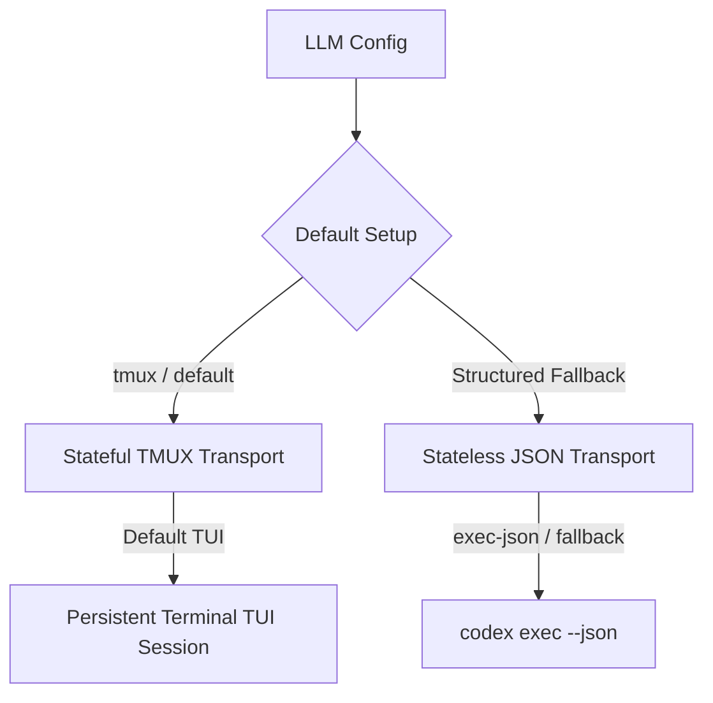

# Codex CLI Coding Agent Contract Specification

## 🌟 Overview

This document defines the interface and execution contracts we rely on when using `codex-cli` (`codex`) as an agentic coding backend. The adapter is fully integrated under the `llmtypes.Model` interface and operates on a dual-transport model, defaulting to the robust, stateful tmux terminal environment.

---

## 🏗️ Dual-Transport Model

`codex-cli` supports two distinct transport modes:



### 1. Stateful TMUX Transport (Default Path)
*   **Behavior:** Spawns a persistent, stateful `tmux` terminal session running the interactive Codex CLI TUI. The orchestrator interacts with Codex programmatically by pasting prompts directly into the terminal, observing state updates, and reading completed assistant turns.
*   **Status:** Default execution path for interactive chat. Fully matches the shape and contract of Claude Code, Gemini CLI, Cursor, and Antigravity.
*   **Active Contract configuration:** Specified in [coding_agent_contract.go](file:///Users/mipl/ai-work/multi-llm-provider-go/coding_agent_contract.go) with `Transport: CodingAgentTransportTmux` and `StructuredFallback: true`.

### 2. Stateless Structured Transport (Structured Fallback)
*   **Behavior:** Runs `codex exec --json --prompt <prompt>`.
*   **Status:** Used for non-tmux execution, automated workflows, batch/cron contexts, or headless servers without tmux available.

---

## 🖥️ Stateful TMUX Transport Details (Default)

### Session Registry & Lifecycle
Long-running terminal sessions are mapped and maintained in an in-memory registry keyed by the calling application's session identifier:
```text
application_session_id ──> mlp-codex-cli-int_xxx
```
*   **Model Selection:** Launches `codex` inside tmux. Unless a specific Codex model is overridden by the caller via `WithCodexModel(model)`, it defaults to the configured default (e.g. `gpt-5.5`).
*   **Interaction Loop:** Inputs are pasted using `tmux load-buffer`, `tmux paste-buffer -p -r`, and `tmux send-keys C-m`.
*   **Live Steering:** While Codex is working, live `/steer` messages are routed to the same tmux session and pasted directly into the TUI.
*   **Teardown & Retention:** Close tmux sessions after idle timeouts (default 20 minutes, configurable via `CODEX_CLI_INTERACTIVE_IDLE_TIMEOUT_SECONDS`) or explicit cleanup. Keeps the real tmux pane alive for a shared bounded retention window (default 30 minutes) so the UI terminal remains inspectable/debuggable.

### Token & Cost Tracking
Unlike generic tmux estimates based on text lengths, Codex CLI TUI writes accurate execution transcripts natively. The adapter reads these files from:
```text
~/.codex/sessions/YYYY/MM/DD/rollout-<timestamp>-<session-uuid>.jsonl
```
This enables the adapter to surface exact input/output/cache tokens and USD costs directly from real execution logs!

#### Rollout Parser Details
The adapter parses `session_meta`, `turn_context`, and `token_count` event messages:
*   **Thread Identification:** Extracts the Codex session UUID (`ev.Payload.ID`) and session working directory (`ev.Payload.CWD`) from `session_meta` events.
*   **Model Detection:** Extracts `latestModel` from `turn_context` events (`ev.Payload.Model`).
*   **Accounting Schema:** Matches `last_token_usage` snap containing:
    ```json
    {
      "input_tokens": 12500,
      "cached_input_tokens": 10000,
      "output_tokens": 1500,
      "reasoning_output_tokens": 400,
      "total_tokens": 14000
    }
    ```
*   **Prompt Cache Discount Calculation:** Since Codex reports `input_tokens` as the total prompt-side count (uncached + cached), the adapter computes the uncached prompt tokens as `input_tokens - cached_input_tokens` (with a floor of 0) and maps that to `PromptTokens`. It surfaces `cached_input_tokens` as `CachedContentTokens` and as `"cache_read_input_tokens"` in `Additional`.
*   **Reasoning Tracking:** Surfaces `reasoning_output_tokens` under `ReasoningTokens`.

### Workspace Settings & Policies
Workspace rules and custom configurations are isolated under the active directory:
*   **System Prompts:** Loaded natively from `<workingDir>/AGENTS.md` (Codex's project-instructions convention) or user-level `~/.codex/AGENTS.md` rules. When `WithWriteProjectInstructionFile(true)` is set, the adapter writes the per-session system prompt to `AGENTS.md` (and byte-restores any pre-existing operator content on teardown so user-owned content is preserved).
*   **MCP Configs:** Scoped settings and custom MCP servers are passed as command overrides dynamically (`-c mcp_servers.<name>...`). If `WithWriteProjectInstructionFile(true)` is active, the adapter can also project a local `.codex/config.toml` containing equivalent `[mcp_servers]` tables.
*   **Tool Controls & Features:** Features can be disabled/enabled via `WithDisableShellTool()`, `WithDisableFeatures("feature1,feature2")`, and `WithEnableFeatures(...)`.
    *   **MCP-Only Mode:** Disabling built-in shell tool via `WithDisableShellTool()` routes all workspace actions exclusively through our policy-controlled MCP bridge.

### Turn Completion & Done Detection
A turn is considered completed only after Codex returns to an idle input line showing the prompt marker or cursor. The parser filters out TUI decorations, progress indicators, shortcuts, borders, and user prompt echoes to extract only the generated assistant content.

---

## 📑 Stateless Structured Transport Details (Fallback)

### Launch Parameters
For single-turn or stateless programmatic execution, the CLI is invoked with:
```bash
codex exec --json \
  --full-auto \
  --model gpt-5.5 \
  --disable shell_tool \
  -c 'approval_policy="never"' \
  "prompt text here"
```
*   **System Prompts:** Passed via the `-c developer_instructions=...` override.
*   **Tool Control:** Disable the built-in shell tool with `--disable shell_tool` when the runtime wants Codex to use only the MCP bridge.
*   **Approval Mode:** Use `approval_policy="never"` for non-interactive MCP calls.

### JSONL Event Parsing
Each line of stdout is parsed dynamically to emit:
*   **Assistant Prose Chunks:** Extracted from `agent_message` (`ev.Payload.Text`).
*   **Tool Call Starts:** Parsed from `command_execution`, `mcp_call`, `mcp_tool_call`, `web_search`, and `file_change`.
*   **Tool Call Ends:** Captures the tool execution results.
*   **Token Usage:** Extracted from `turn.completed` (`ev.Payload.Usage`).
*   **Thread ID:** Captured from `thread.started` (`ev.Payload.ThreadID`) to manage conversation continuity.

### Multi-Turn Conversational State
Conversational multi-turn continuity is established via native thread IDs rather than persistent terminal screens:
1.  **Start:** Call `codex exec --json --model gpt-5.5 <prompt>` and extract `codex_thread_id`.
2.  **Resume:** Call `codex exec resume --json --model gpt-5.5 <thread_id> <latest prompt>`.
3.  On resume, only the newest human prompt is submitted; previous turns remain loaded natively in the remote thread.

---

## 🧪 Testing

The Codex CLI has comprehensive test coverage, distinguishing between lightweight static parser tests and heavy real CLI integration contract tests.

### 1. Pure Unit and Mock-Backed Tests
Cover parser mechanics, status-line emissions, artifact restoration, and delta deduping without invoking real binaries:
*   `TestExtractCodexVisibleAssistantTextFiltersTUIProgress`
*   `TestStripCodexHistoricalAssistantTextRemovesPaneReplay`
*   `TestStreamCodexAssistantDeltaDedupesCumulativeRedrawAfterContinuationChunks`
*   `TestCodexIdleDetectionIgnoresAssistantProseAboutRunning`
*   `TestRenderCodexMCPServersTOMLBasicShape`
*   `TestWriteCodexProjectMCPConfigTOMLRestoresOperatorContent`
*   `TestWriteCodexProjectArtifactsComposesAGENTSAndConfigTOML`

### 2. Running Real TMUX Transport Tests
Requires a real `codex` CLI installed and a valid `CODEX_API_KEY`:
```bash
export RUN_CODEX_CLI_REAL_E2E=1
export RUN_CODEX_CLI_INTERACTIVE_E2E=1
export CODEX_API_KEY=<key>
go test -v ./pkg/adapters/codexcli -run 'TestCodexCLIRealInteractive|TestCodexCLIInteractiveIntegrationSpark' -timeout 6m
```

### 3. Running Real Structured Transport Tests
Requires a real `codex` CLI installed and a valid `CODEX_API_KEY`:
```bash
export RUN_CODEX_CLI_STREAM_JSON_E2E=1
export CODEX_API_KEY=<key>
go test -v ./pkg/adapters/codexcli -run 'TestCodexCLIRealExecJSON' -timeout 6m
```

### 4. Running Native Web-Search Tests
Requires a real `codex` CLI installed and a valid `CODEX_API_KEY`:
```bash
export RUN_CODEX_CLI_SEARCH_WEB_E2E=1
export CODEX_API_KEY=<key>
go test -v ./pkg/adapters/codexcli -run 'TestCodexCLIRealSearchWeb' -timeout 4m
```

> [!IMPORTANT]
> Always run E2E validation tests before releasing Codex CLI transport changes. Static parser fixtures remain useful for UI quality regressions, but transport behavior must be proven against the real CLI.
