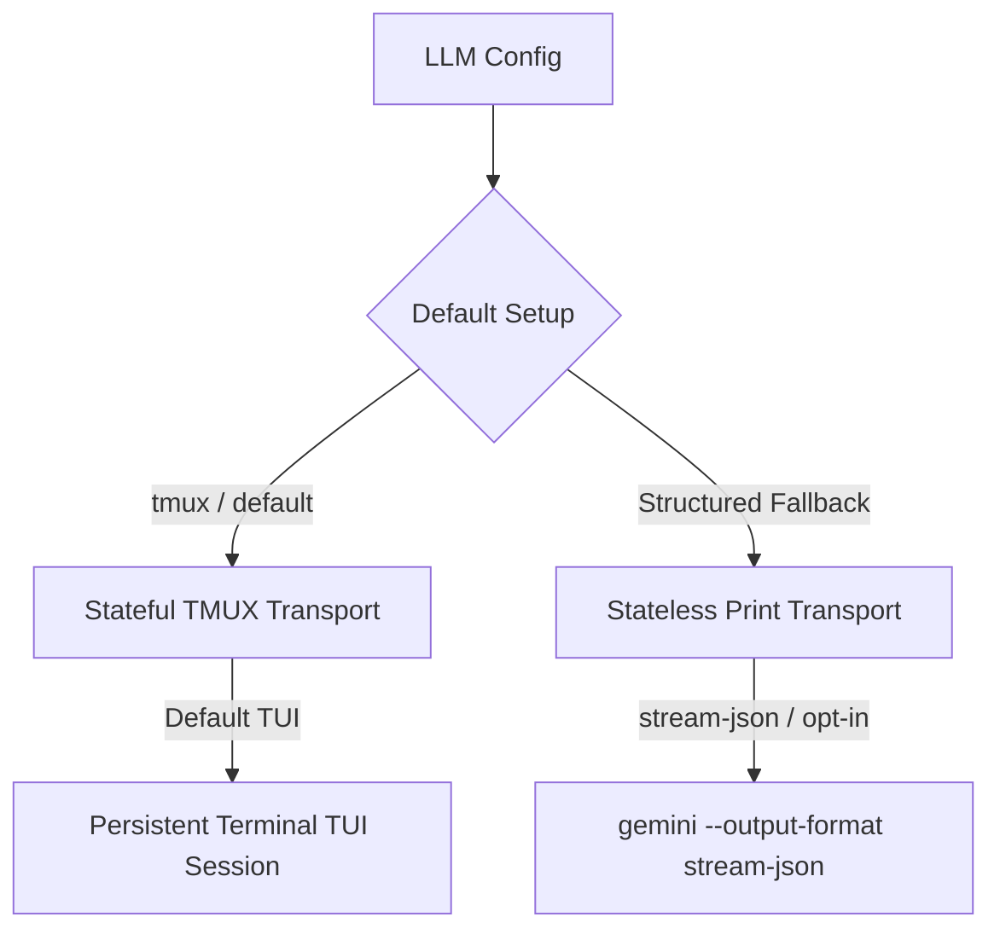

# Gemini CLI Coding Agent Contract Specification

## 🌟 Overview
This document defines the interface and execution contracts we rely on when using `gemini-cli` (`gemini`) as an agentic coding backend. The adapter is fully integrated under the `llmtypes.Model` interface and operates on a dual-transport model.

---

## 🏗️ Dual-Transport Model

`gemini-cli` supports two distinct transport modes:



### 1. Stateful TMUX Transport (Default Path)
*   **Behavior:** Spawns a persistent, stateful `tmux` terminal session running the interactive Gemini CLI TUI. The orchestrator interacts with Gemini programmatically by pasting prompts directly into the terminal, observing state updates, and reading completed assistant turns.
*   **Status:** Default execution path for interactive chat. Fully matches the shape and contract of Claude Code, Codex, Cursor, and Antigravity.

### 2. Stateless Print/Stream Transport (Structured Fallback)
*   **Behavior:** Runs `gemini --output-format stream-json --prompt <latest_prompt>`.
*   **Status:** Used for non-tmux execution, automated workflows, batch/cron contexts, or headless servers without tmux available.

---

## 🖥️ Stateful TMUX Transport Details (Default)

### Session Registry & Lifecycle
Long-running terminal sessions are mapped and maintained in an in-memory registry keyed by the calling application's session identifier:
```text
application_session_id ──> mlp-gemini-cli-int_xxx
```
*   **Model Selection:** Launches `gemini` inside tmux. Unless a specific Gemini model is overridden by the caller, it defaults to the latest configured lightweight model (e.g. `gemini-3.1-flash-lite`).
*   **Interaction Loop:** Inputs are pasted using `tmux load-buffer`, `tmux paste-buffer -p -r`, and `tmux send-keys C-m`.
*   **Live Steering:** While Gemini is working, live `/steer` messages are routed to the same tmux session and pasted directly into the TUI.
*   **Teardown:** Close tmux sessions after idle timeouts or explicit cleanup.

### Token & Cost Tracking
Unlike generic tmux estimates based on text lengths, Gemini CLI TUI writes accurate execution transcripts natively. The adapter reads these files from:
```text
~/.gemini/tmp/gemini-cli-project-<projectDirID>/chats/session-*.jsonl
```
This enables the adapter to surface exact input/output/cache tokens and USD costs directly from real execution logs!

### Workspace Settings & Policies
Workspace rules and custom configurations are isolated under the active directory:
*   **System Prompts:** Loaded natively from `<workingDir>/GEMINI.md` or user-level `~/.gemini/GEMINI.md` rules.
*   **MCP Configs:** Scoped settings and custom MCP servers are loaded from `<workingDir>/.gemini/settings.json` or `~/.gemini/settings.json`.
*   **Tool Controls:** Security policies under `.gemini/policies/*.toml` and optional hooks under `.gemini/hooks` ensure built-in shell/filesystem commands remain blocked, routing all programmatic edits through our policy-controlled MCP bridge.

### Turn Completion & Done Detection
A turn is considered completed only after Gemini returns to an idle input line showing the prompt marker:
```text
Type your message
```
The parser filters out TUI decorations, updates, shortcuts, borders, and user prompt echoes to extract only the generated assistant content.

---

## 📑 Stateless Print/Stream Transport Details (Fallback)

### Launch Parameters
For single-turn or stateless programmatic execution, the CLI is invoked with:
```bash
gemini \
  --output-format stream-json \
  --prompt "<prompt>"
```
*   **System Prompts:** Passed via the `GEMINI_SYSTEM_MD` environment variable.
*   **Workspace Configs:** Handled via the scoped `.gemini/settings.json`.
*   **Resume Parameters:** Captures `gemini_session_id` and `gemini_project_dir_id` from stream-json responses, allowing the next turn to resume conversational states via:
    ```bash
    gemini \
      --output-format stream-json \
      --resume <session_id> \
      --prompt "<next_prompt>"
    ```

---

## 🧪 Testing

The Gemini CLI has comprehensive, real E2E test coverage across both transport layers.

### 1. Running Real TMUX Transport Tests
Requires a real `gemini` CLI installed and a valid `GEMINI_API_KEY`:
```bash
export RUN_GEMINI_CLI_REAL_E2E=1
export GEMINI_API_KEY=<key>
go test -v ./pkg/adapters/geminicli -run 'TestGeminiCLIRealInteractive|TestGeminiCLIInteractiveIntegrationFlashLite' -timeout 6m
```

### 2. Running Real Structured Transport Tests
Requires a real `gemini` CLI installed and a valid `GEMINI_API_KEY`:
```bash
export RUN_GEMINI_CLI_STREAM_JSON_E2E=1
export GEMINI_API_KEY=<key>
go test -v ./pkg/adapters/geminicli -run 'TestGeminiCLIRealStreamJSON' -timeout 6m
```

### 3. Running Native Web-Search Tests
Requires a real `gemini` CLI installed and a valid `GEMINI_API_KEY`:
```bash
export RUN_GEMINI_CLI_SEARCH_WEB_E2E=1
export GEMINI_API_KEY=<key>
go test -v ./pkg/adapters/geminicli -run 'TestGeminiCLISearchWebSmoke' -timeout 4m
```

> [!IMPORTANT]
> Always run E2E validation tests before releasing Gemini CLI transport changes. Static parser fixtures remain useful for UI quality regressions, but transport behavior must be proven against the real CLI.
