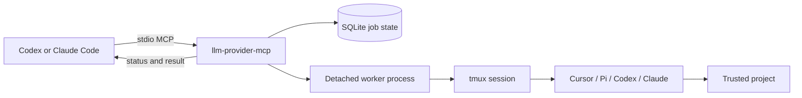

# Architecture

`llm-provider-mcp` is a local stdio MCP server with a durable asynchronous job
layer and tmux-backed coding-agent adapters.

## Components

| Component | Package | Responsibility |
|---|---|---|
| CLI | `cmd/llm-provider-mcp` | MCP entry point and lifecycle commands |
| MCP server | `pkg/codingagentmcp` | Tool schemas, validation, responses |
| Job manager | `pkg/codingagentjob` | Persistence, workers, cancellation, recovery |
| Setup | `pkg/codingagentsetup` | Detection, auth, registration, skills |
| Model catalog | `pkg/codingagentmodels` | Curated and provider-visible selectors |
| Terminal capture | `pkg/tmuxcapture` | Bounded, cleaned progress snapshots |
| Adapters | `pkg/adapters/*cli` | Native CLI launch, prompts, tools, extraction |

## Process Model



The MCP request that creates a job returns after persistence, not after provider
completion. A worker process owns the long-running provider call so the job can
outlive the original MCP tool invocation.

## Persistence

The default database is:

```text
~/.local/state/llm-provider-mcp/jobs.db
```

`LLM_PROVIDER_MCP_STATE` overrides this path. The manager records timestamps,
provider, workspace, status, progress, tmux metadata, final result, and failure
details.

## Provider Contract

`CodingAgentProviderContracts()` is the source of truth for supported coding
CLIs and capabilities. Setup, model discovery, and job validation consume the
same contracts so deprecated or incomplete providers are not advertised by one
surface and rejected by another.

The provider adapters share tmux lifecycle, pane capture, session registry,
project artifact, and process cleanup helpers where behavior is common.

## Terminal Progress

The status tool normally returns structured job progress only. When terminal
output is requested, `pkg/tmuxcapture` captures a bounded scrollback tail,
removes ANSI control sequences, repairs UTF-8 boundaries, and limits the text
returned to the host.

The same capture package is consumed by MCP Agent Builder, preventing two
different implementations of terminal-progress handling.

## Compatibility Boundary

The repository also exports a broader Go provider API used by MCP Agent and MCP
Agent Builder. Downstream compile checks run in CI before changes merge. The Go
module path remains `github.com/manishiitg/multi-llm-provider-go` even though
the repository product is branded `llm-provider-mcp`.
