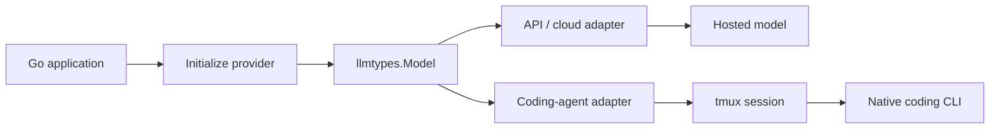
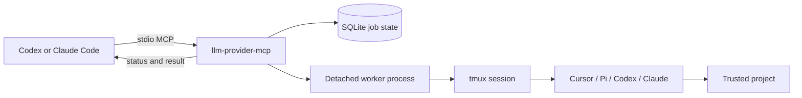

# Architecture

`multi-llm-provider-go` is a provider runtime with two transport families:
hosted API/cloud adapters and local coding-agent CLI adapters. The optional
`llm-provider-mcp` server adds durable asynchronous delegation on top of the
coding-agent family.

## Components

| Component | Package | Responsibility |
|---|---|---|
| Public provider API | root package | Configuration, initialization, fallbacks, shared behavior |
| Model contracts | `llmtypes` | Messages, responses, tools, streams, metadata, call options |
| Host interfaces | `interfaces` | Logging, events, trace and support contracts |
| API/cloud adapters | `pkg/adapters/*` | Provider SDK/HTTP conversion and model behavior |
| Coding-agent adapters | `pkg/adapters/*cli` | Native CLI launch, prompts, tools, extraction |
| tmux transport | `pkg/adapters/internal/*`, `pkg/tmuxcapture` | Sessions, input, pane capture, process cleanup |
| CLI | `cmd/llm-provider-mcp` | MCP entry point and lifecycle commands |
| MCP server | `pkg/codingagentmcp` | Tool schemas, validation, responses |
| Job manager | `pkg/codingagentjob` | Persistence, workers, cancellation, recovery |
| Setup | `pkg/codingagentsetup` | Detection, auth, registration, skills |
| Model catalog | `pkg/codingagentmodels` | Curated and provider-visible selectors |

## Core Provider Model


```mermaid
flowchart LR
    App[Go application] --> Init[Initialize provider]
    Init --> Model[llmtypes.Model]
    Model --> API[API / cloud adapter]
    Model --> Agent[Coding-agent adapter]
    API --> Remote[Hosted model]
    Agent --> Tmux[tmux session]
    Tmux --> Native[Native coding CLI]
```

The root package chooses and initializes an adapter from `Config`. Every text
provider returns `llmtypes.Model`, allowing the caller to keep the same message,
response, streaming, tool, metadata, logging, and event abstractions while
changing providers. Specialized factories initialize embedding, image, video,
audio, transcription, and music interfaces.

## Optional MCP Process Model


```mermaid
flowchart LR
    Host[Codex or Claude Code] -->|stdio MCP| Server[llm-provider-mcp]
    Server --> DB[(SQLite job state)]
    Server --> Worker[Detached worker process]
    Worker --> Tmux[tmux session]
    Tmux --> Target[Cursor / Pi / Codex / Claude]
    Target --> Workspace[Trusted project]
    Server -->|status and result| Host
```

The MCP request that creates a job returns after persistence, not after provider
completion. A worker process owns the long-running coding-agent call so the job
can outlive the original MCP tool invocation. This job layer is not involved
when an application calls the Go provider API directly.

## Persistence

The default database is:

```text
~/.local/state/llm-provider-mcp/jobs.db
```

`LLM_PROVIDER_MCP_STATE` overrides this path. The manager records timestamps,
provider, workspace, status, progress, tmux metadata, final result, and failure
details.

## Provider Contracts

`llmtypes.Model` is the common text-generation contract. Provider-specific
capabilities are represented through metadata, additional interfaces, and call
options rather than assuming that every model supports every feature.

`CodingAgentProviderContracts()` is the source of truth for supported coding
CLIs and capabilities. Setup, model discovery, and job validation consume the
same contracts so deprecated or incomplete providers are not advertised by one
surface and rejected by another.

The provider adapters share tmux lifecycle, pane capture, session registry,
project artifact, and process cleanup helpers where behavior is common.

## Terminal Progress

The status tool normally returns structured job progress only. When terminal
output is requested, `pkg/tmuxcapture` captures a bounded scrollback tail,
removes ANSI control sequences, repairs UTF-8 boundaries, and limits the text
returned to the host.

The same capture package is consumed by MCP Agent Builder, preventing two
different implementations of terminal-progress handling.

## Public API Stability

The Go module path is `github.com/manishiitg/multi-llm-provider-go`. MCP Agent
and MCP Agent Builder consume this public API, and downstream compile checks run
in CI before changes merge. MCP-specific schemas and persisted job state remain
in their dedicated packages so they do not define the general provider API.
